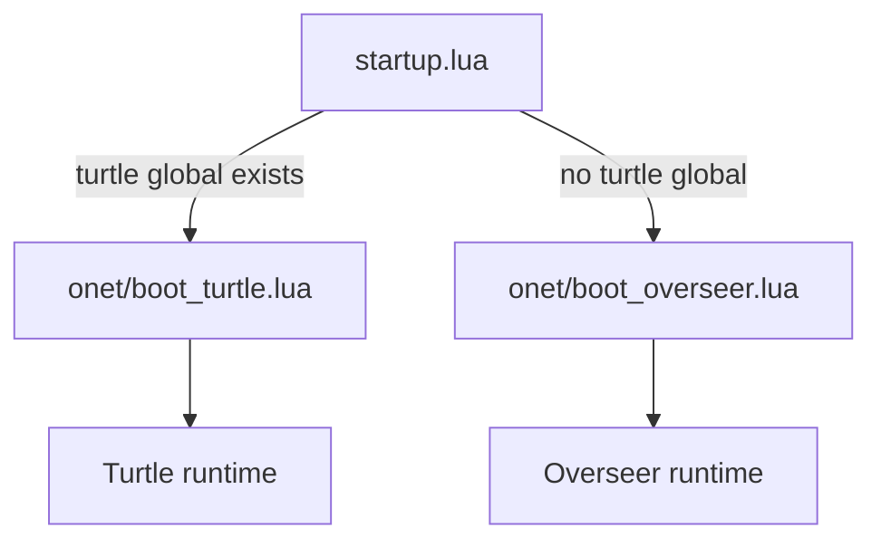
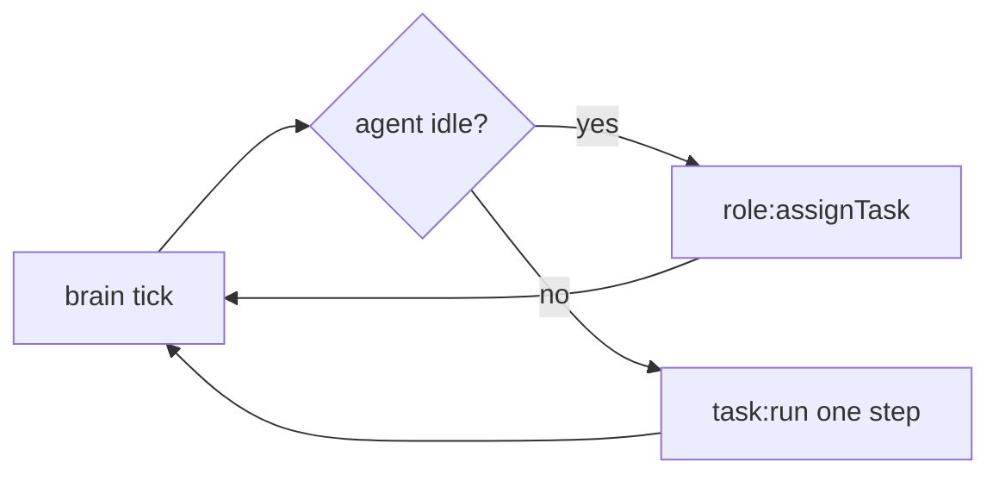
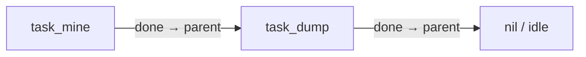
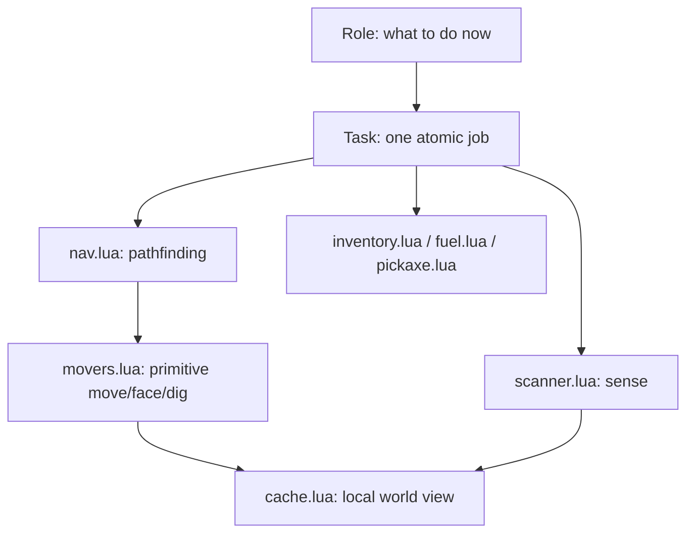
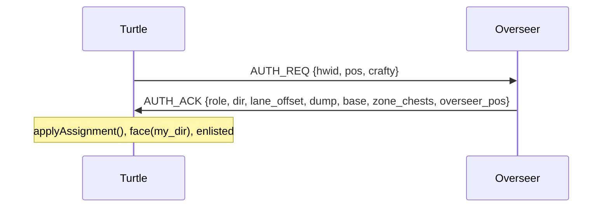
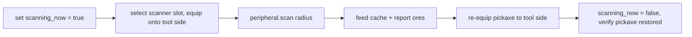
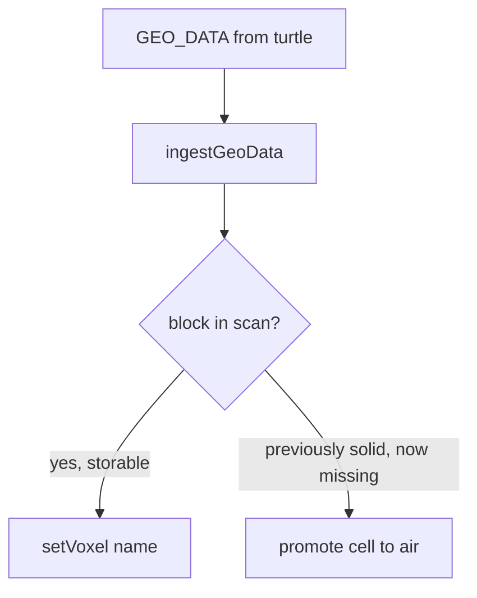

# O-NET V2 — Architecture

This document describes how O-NET V2 works at the system level: the two-runtime
split, the agent/task model that drives every turtle, how roles layer onto
tasks and tasks onto navigation, the network protocol, the coordination
mechanisms (push broker + tile reservation), the scanner hot-swap, ore
clustering, voxel air inference, and the self-replication lifecycle.

It is grounded in the actual code under [../onet/](../onet/). For deployment and
the file-by-file index, see the top-level [README.md](../README.md) and the
[documentation index](README.md).

---

## 1. Two runtimes, one tree

Every device runs the same code. [../startup.lua](../startup.lua) inspects the
`turtle` global and dispatches:



- The **overseer** is a stationary computer that holds the authoritative world
  model and commands the fleet.
- A **turtle** is an autonomous agent that mines, scans, and reports.

Both share [../onet/config.lua](../onet/config.lua) — pure data, no hardware
calls — as the single source of truth (protocol name, reserved slots, fuel
thresholds, grid spacing, priorities, target fleet size, etc.).

### Boot sequences

**Turtle** ([../onet/boot_turtle.lua](../onet/boot_turtle.lua)):

```
detectHardware → openModem → fuel.wakeUp → calibrate (GPS)
→ network.handshake (AUTH_REQ/ACK) → equip pickaxe → forage coal
→ parallel.waitForAll(brain, listener, heartbeat)   -- each pcall-supervised
```

**Overseer** ([../onet/boot_overseer.lua](../onet/boot_overseer.lua)):

```
find modem/monitor/vault → gps.locate → gridmap.setOrigin
→ persist.loadConfig + loadMap → overseer.run()
→ parallel.waitForAll(listener, pruner, orders, mapsave, display, terminal)
```

Both runtimes wrap each thread in a `supervised(...)` helper: a thread that
crashes logs an `ALERT` and restarts after a short delay instead of dropping the
device to the shell or taking the base offline.

---

## 2. The turtle agent loop (Overmind model)

A turtle's behavior is an **agent driving tasks**, inspired by a StarCraft
"Overmind/creep" design. The pieces:

- **Brain** ([../onet/turtle/brain.lua](../onet/turtle/brain.lua)) — owns one
  `Agent` and the current `Role`. Each tick: if the agent is idle, ask the role
  for a task; otherwise drive the current task one step.
- **Role** ([../onet/turtle/roles/](../onet/turtle/roles/)) — decides *what the
  turtle is for right now*. A role's only job is `assignTask(agent)`: pick the
  next Task and set `state.current_state` (which determines move priority).
- **Task** ([../onet/turtle/tasks/task.lua](../onet/turtle/tasks/task.lua)) — an
  atomic, composable unit of work with an explicit termination condition.



### Task chaining

Tasks chain through a `.parent` link. `Task:run()` does one unit of work while
`isWorking()` holds, then **falls back to its parent** when done. This lets a
role express "dump cargo, then resume mining" as a mine task whose parent is a
dump task — no explicit state machine required.



Key task properties: `done`, `failed`, `target`, `parent`, plus overridable
`isValidTarget()` and `work()`. `work()` returning `false` marks the task
`failed`; the agent then becomes idle and the role reassigns.

### Live role swap

The brain compares `state.role` to the role it loaded each tick. The overseer
can send a `ROLE_ASSIGN` message and the brain hot-swaps the role module (e.g. a
miner becomes a builder) **without a reboot**, discarding the in-flight task.
Role modules are loaded with `pcall(require, ...)`; a role a given turtle does
not carry (e.g. `role_genesis` on a non-crafty miner) falls back to
`role_miner` instead of crashing the brain.

---

## 3. Role → Task → Nav/Movers layering

Behavior is strictly layered, each level depending only on the one below:



- **movers.lua** is the only place that calls raw `turtle.forward/up/dig/turn`.
- **nav.lua** composes movers into pathing: greedy axis movement for cheap
  progress, A* local detours when blocked, a recovery spiral / climb-over when
  A* fails, and waypoint splitting for long routes.
- **cache.lua** is the turtle's local view of the world, fed by scans; the
  navigator treats *unknown as solid*, so the cache only needs to record the
  interesting (non-stone) cells.
- Tasks orchestrate these plus sensing, inventory, fuel, and pickaxe modules to
  accomplish a single job.

---

## 4. Network & protocol flow

All messages travel over Rednet under protocol **`ONET_V2`**
(`cfg.PROTOCOL`). The turtle's nervous system is
[../onet/turtle/network.lua](../onet/turtle/network.lua); the overseer's
intake is [../onet/overseer/director.lua](../onet/overseer/director.lua),
which dispatches to the specialized handlers.

### Enlistment handshake



The turtle broadcasts `AUTH_REQ` until an overseer ACKs (bounded attempts). The
ACK carries the turtle's role, lane direction, dump/base coordinates, storage
zone chests, and the overseer position (which is also the base-protection
center). `CONFIG` messages later update any of these live.

### Message families

Turtle → overseer (selected): `AUTH_REQ`, `HEARTBEAT`, `GEO_DATA`,
`ORE_REPORT`, `ORE_MINED`, `ALERT`, `PUSH_REQ`, `RESERVE_REQ`, `RESERVE_REL`,
`PARK_RELEASE`.

Overseer → turtle (selected): `AUTH_ACK`, `CONFIG`, `CMD_START`, `CMD_STOP`,
`CMD_RECALL`, `ROLE_ASSIGN`, `SEGMENT_GRANT`, `SEARCH_JOB`, `COAL_LOC`,
`GOTO`, `YIELD`, `RESERVE_ACK`, `PICK_ANSWER`, `CRAFT_AUTH`.

Every handler type-checks its payload before use. The CORE handlers
(`AUTH`, `RESERVE_ACK`, `PUSH`/`YIELD`) are ported verbatim from the debugged V1
listener; the V2 handlers (`ROLE_ASSIGN`, `SEGMENT_GRANT`, `SEARCH_JOB`,
`COAL_LOC`, `PICK_ANSWER`, `CRAFT_AUTH`) are layered alongside.

> **Note:** a few message strings used live in code are *not* registered
> constants in [../onet/lib/proto.lua](../onet/lib/proto.lua) — e.g.
> `PARK_RELEASE` is sent/handled as a literal string rather than a `proto.*`
> field. Treat the `proto.lua` table as the canonical registry; these literals
> are the exceptions to watch for when auditing the protocol surface.

---

## 5. Coordination: push broker + tile reservation

Many turtles share narrow tunnels, so two mechanisms prevent gridlock and
collisions. Both key off **move priority** from `cfg.PRIORITY` (lower number =
more urgent, never yields):

```
GOTO=1  RTB_FUEL=2  RTB_DUMP=3  FETCH_PICK=4  MINING=5
SEARCH=6  BUILDER=7  GENESIS=7  STANDBY=8  PARKED=9
```

`state.current_state` (set by the role) is what the turtle and the broker read
for that turtle's priority.

### Push broker

When a turtle is blocked by another turtle sitting on the tile it needs, it
sends a `PUSH_REQ` with its target tile and priority. The overseer's
[../onet/overseer/push_broker.lua](../onet/overseer/push_broker.lua) finds whoever
occupies that tile and, **only if the blocker is equal-or-lower urgency**, sends
it a direct `YIELD`. A more-urgent blocker is left alone.

```mermaid
sequenceDiagram
    participant P as Pusher (pri p)
    participant O as Overseer broker
    participant B as Blocker (pri b)
    P->>O: PUSH_REQ {want tile, priority p}
    O->>O: find turtle on tile → its priority b
    alt b >= p (blocker not more urgent)
        O->>B: YIELD
        B->>B: step aside (up, else any free dir)
    else b < p (blocker more urgent)
        O-->>P: (no action; pusher waits)
    end
```

### Tile reservation

Before entering a contested tile a turtle can send `RESERVE_REQ`; the overseer
replies `RESERVE_ACK` granting a short-lived hold (`RESERVE_TTL_MS`), and the
turtle later sends `RESERVE_REL`. `RESERVE_WAIT_MS` bounds how long it waits for
a grant. This prevents two turtles from forming the *intent* to occupy the same
cell simultaneously, complementing the reactive push protocol.

---

## 6. Scanner hot-swap

Each mining turtle has one tool side and a reserved scanner slot (slot 1). To
sense its surroundings it must temporarily swap the geo scanner onto the tool
side, scan, then restore the pickaxe.
[../onet/turtle/scanner.lua](../onet/turtle/scanner.lua) does this:



The `scanning_now` lock is essential: without it the inventory/pickaxe
protection logic could race the swap and dump the scanner. Tool protection
always keys on **slot numbers** (slot 1 scanner, slot 2 pickaxe) *before* any
`getItemDetail` call, because NBT/Forge-tagged tools can make `getItemDetail`
return `nil`. After the swap the code verifies the pickaxe is back and recovers
it if not.

---

## 7. World model: ore clustering & voxel air inference

The overseer maintains the authoritative map; turtles only hold a local cache.

### Voxel database

[../onet/overseer/voxelmap.lua](../onet/overseer/voxelmap.lua) stores only blocks
worth keeping — ores, air, hazards (lava/water), and fixtures (chests,
computers, turtles, furnaces). **Stone-class blocks are deliberately not
stored**: the navigator already treats unknown cells as solid, so recording
stone would only waste memory.

### Volatile-solid air inference

The subtle part: when a block a turtle previously reported is **absent** from a
later scan that covers its cell, the map promotes that cell to air. This yields
passive cave/tunnel mapping without anyone ever sending an explicit "air"
report — geometry fills in as a side effect of normal scanning.



### Ore clustering

Reported ores are grouped by proximity (within `CLUSTER_RADIUS`) so the overseer
can dispatch a turtle to a *vein* rather than chasing individual blocks, and so
retrieval orders (`getme`) target known clusters first. A bounded recent-ore
feed (`ORE_FEED_MAX`) drives the cockpit's live ore display.

---

## 8. Self-replication lifecycle (Genesis)

O-NET maintains a target population (`TARGET_FLEET`) and can rebuild losses.

```mermaid
sequenceDiagram
    participant Pop as population.lua (overseer)
    participant B as Builder turtle
    participant G as Genesis (crafty) turtle
    participant New as New turtle

    Pop->>Pop: count live turtles (silence > LOSS_TIMEOUT = dead)
    Note over Pop: enforce replace-on-loss, never exceed TARGET_FLEET,<br/>never consume the last turtle base
    Pop->>B: gather + smelt GENESIS_RECIPE into GENESIS_MAT zone
    Pop->>G: CRAFT_AUTH (live_count < target)
    G->>G: role_genesis arranges 3x3 grid; task_craft runs single turtle.craft()
    G->>New: write /onet tree + /startup.lua
    New->>Pop: AUTH_REQ on power-on (enlists like any turtle)
```

Key contracts ([../onet/config.lua](../onet/config.lua)):

- **`TARGET_FLEET` is a hard cap**; population control is *replace-on-loss only*
  and never lets the fleet exceed it.
- Genesis **never consumes the last turtle base** — the system cannot replicate
  itself out of existence.
- Genesis is **crafty-turtle-only**. A crafting upgrade is what exposes
  `turtle.craft`; the role idles/falls back on a non-crafty turtle.
- **`role_genesis` arranges the 3×3 crafting grid** from materials the Builder
  gathered into the `GENESIS_MAT` zone; `task_craft` then performs the
  **single** `turtle.craft()`, places the new turtle, and signals `CRAFT_DONE`.
- `GENESIS_RECIPE` is mostly fleet-gathered; the lone manual input is an **ender
  eye** (for the advanced ender modem replication requires).

---

## 9. Cross-cutting invariants

These hold across the whole codebase and are easy to break:

- **Protocol** is always `ONET_V2`.
- **Reserved slots** 1 (scanner) and 2 (pickaxe); cargo is 3–16; tool
  protection keys on slot numbers before `getItemDetail`.
- **≤ 200 locals per scope** with forward declarations — the modules are
  structured to stay under the Lua VM limit.
- **Threads are pcall-supervised** on both runtimes and auto-restart on crash.
- **GPS heading is verified live on restore**, never trusted blindly from disk.
- **Tagged logging** on every state transition and every craft/build action.
